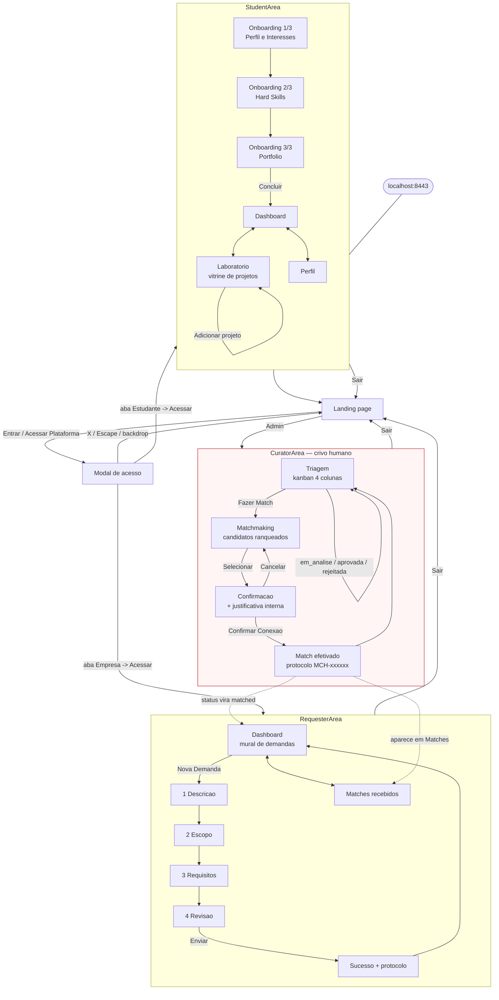

# Análise do front-end — VitrineIC

Estado do código em `608727e feat: Todas as telas`. Levantamento feito por
leitura do código e navegação pela aplicação rodando localmente.

> **Mudou tudo desde a análise anterior.** O que era uma landing page com um
> modal decorativo virou um protótipo navegável de 4.678 linhas com as três
> áreas de usuário implementadas — incluindo o **crivo humano**, que antes não
> existia em nenhuma forma. O projeto saiu de "porta de entrada sem prédio"
> para "prédio inteiro, sem fundação".

---

## 1. Panorama

| Arquivo | Linhas | Componentes | `useState` | Papel |
|---|---:|---:|---:|---|
| `src/App.tsx` | 744 | 7 | 6 | Landing, modal de acesso e roteamento raiz |
| `src/StudentArea.tsx` | 1.440 | 15 | 9 | Área do estudante |
| `src/RequesterArea.tsx` | 1.335 | 13 | 7 | Área do solicitante |
| `src/CuratorArea.tsx` | 1.149 | 14 | 8 | Área da curadoria (crivo humano) |
| **Total** | **4.678** | **49** | **30** | |

Stack inalterada: React 19, Vite 8, TypeScript strict, Tailwind v4, sem
roteador, sem estado global, sem backend, sem testes.

O crescimento foi por **adição de arquivos irmãos**, não por camadas: cada área
nasceu como um arquivo autossuficiente que replica o que precisa. É uma
arquitetura em ilhas — rápida para produzir telas em paralelo, cara para
integrar depois.

### Nota sobre o ambiente

Este commit **restaurou a dependência do Figma Make** que havia sido removida
localmente: `.figma/make/` voltou, o `vite.config.ts` tem de novo 12 kB de
plugins proprietários, o `index.html` voltou aos placeholders (a aba do
navegador mostra "Figma Make App") e o `package.json` chama-se
`figma-make-app`. O dev server roda em `:8443`, não `:5173`.

---

## 2. Arquitetura de navegação

Continua **sem roteador**. A navegação é feita por estado em dois níveis.

**Nível 1 — `App.tsx`**, três booleanos com early return (linhas 379–386):

```tsx
const [inStudentArea,   setInStudentArea]   = useState(false);
const [inRequesterArea, setInRequesterArea] = useState(false);
const [inCuratorArea,   setInCuratorArea]   = useState(false);

if (inStudentArea)   return <StudentArea   onBack={...} />;
if (inRequesterArea) return <RequesterArea onBack={...} />;
if (inCuratorArea)   return <CuratorArea   onBack={...} />;
```

A exclusividade entre as áreas vem da **ordem dos ifs**, não do tipo. Um
`useState<Area>` com união de strings expressaria a mesma regra tornando
impossível o estado inconsistente — a informação "o usuário está em uma área
por vez" existe na cabeça de quem escreveu, não no código.

**Nível 2 — dentro de cada área**, um `view` em string controla a tela:

| Área | Estado | Valores |
|---|---|---|
| `StudentArea` | `onboarded` + `view` | `dashboard`, `lab`, `profile` |
| `RequesterArea` | `view` tipado | `dashboard`, `new`, `success`, `matches` |
| `CuratorArea` | `view` tipado | `triage`, `matchmaking`, `confirm`, `confirmed` |

Duas consequências arquiteturais: **não há URL por tela**, então nada é
compartilhável por link nem responde ao botão voltar do navegador; e **o estado
vive só na memória**, então recarregar devolve o usuário ao início — o
estudante refaz o onboarding, os matches confirmados desaparecem.

---

## 3. Telas

São **14 telas**, contra 2 na versão anterior.

### 3.1 Pública (`App.tsx`)

| Tela | Conteúdo |
|---|---|
| **Landing** | Nav, hero, stats, grid de destaques, CTA, footer — inalterada |
| **Modal de acesso** | Abas Estudante / Empresa-Solicitante |

Duas mudanças: os botões `Acessar` dos formulários agora **entram de fato** nas
áreas (`onEnterStudent`, `onEnterCompany`), e a nav ganhou um botão discreto
**`Admin`** que leva à curadoria — sem senha nem papel, o que é coerente com
protótipo, mas significa que a área de moderação está aberta a qualquer visitante.

### 3.2 Área do estudante (`StudentArea.tsx`)

| Tela | Conteúdo |
|---|---|
| **Onboarding 1/3** — Perfil & Interesses | foto, nome, curso, semestre, e-mail institucional, bio, 11 áreas de interesse selecionáveis |
| **Onboarding 2/3** — Hard Skills | tecnologias com proficiência em 4 níveis (Básico → Especialista), via `ProficiencyBars` |
| **Onboarding 3/3** — Portfólio | GitHub, LinkedIn, site, Lattes, upload de documento |
| **Dashboard** | boas-vindas, competências, notificações (convites, visualizações, mensagens), cartão de perfil público com contadores |
| **Laboratório** | projetos com status (`codificação`, `ideação`, `revisão`), stack e repositório; formulário de novo projeto |
| **Perfil** | visualização do perfil montado |

O **Laboratório é a vitrine de projetos** pedida no README, e é a única tela do
sistema, fora da curadoria, com estado que muda de verdade: `useState(SAMPLE_PROJECTS)`
com adição via formulário.

Vale notar a ambição do onboarding: ele coleta **proficiência por tecnologia**,
um dado mais rico do que qualquer outra parte do sistema consome hoje.

### 3.3 Área do solicitante (`RequesterArea.tsx`)

| Tela | Conteúdo |
|---|---|
| **Dashboard** | tabela de 5 demandas com ID, título, área, prazo e status; contadores; linha expansível |
| **Nova Demanda 1–4** | wizard: Descrição → Escopo → Requisitos → Revisão |
| **Sucesso** | confirmação com número de protocolo |
| **Matches** | estudantes selecionados pela curadoria, com % de compatibilidade e expansão de perfil |

O **Dashboard é o mural de demandas**. O wizard em quatro passos e o protocolo
de acompanhamento sugerem um processo formal, quase de protocolo institucional
— é a tela que mais aproxima o produto de um sistema administrativo da
universidade.

### 3.4 Área da curadoria (`CuratorArea.tsx`)

A área mais importante, porque materializa o **crivo humano** que o README
define como inegociável.

| Tela | Conteúdo |
|---|---|
| **Triagem** | kanban de 4 colunas (`nova`, `em_analise`, `aprovada`, `matched`); cards expandem com descrição, skills e ações de status |
| **Matchmaking** | demanda à esquerda, candidatos ranqueados à direita com % de match, skills em comum destacadas, projetos e disponibilidade |
| **Confirmação** | modal com resumo do par, compatibilidade, projetos do estudante e **campo de justificativa interna** |
| **Match efetivado** | protocolo (`MCH-147713`), par confirmado e checklist de próximas ações automáticas |

Percorri esse fluxo inteiro na aplicação: a triagem muda status, o matchmaking
ranqueia, a confirmação grava e a demanda passa a `matched` no kanban.

O desenho acerta a premissa do README: o algoritmo **ordena**, o humano
**decide**. A máquina nunca confirma sozinha — ela apresenta candidatos com
justificativa visível (skills em comum destacadas) e exige um ato deliberado do
curador, com campo para registrar o porquê. O percentual é tratado como
evidência para uma decisão humana, não como a decisão.

---

## 4. Fluxograma completo



As setas pontilhadas são a **intenção** do fluxo, não ligação real: as três
áreas têm bases de dados separadas e não se comunicam (seção 6).

---

## 5. O algoritmo de match

Em `CuratorArea.tsx`, linha 440 — é a única lógica de negócio do sistema:

```ts
function scoreStudent(student, demand): number {
  const matched = student.skills.filter((s) =>
    demand.skills.some((ds) => ds.toLowerCase() === s.toLowerCase())
  ).length;
  return Math.round((matched / demand.skills.length) * 100);
}
```

Percentual de skills da demanda cobertas pelo estudante, por igualdade de
string sem diferenciar maiúsculas.

O que a escolha revela sobre o modelo de compatibilidade adotado:

- **A demanda é o denominador.** O score mede quanto da necessidade foi coberta,
  não quanto do repertório do estudante foi aproveitado. Um especialista amplo e
  um estudante estritamente aderente pontuam igual — decisão defensável para
  triagem, que vale explicitar.
- **Compatibilidade é binária por skill.** Os 4 níveis de proficiência coletados
  no onboarding não entram na conta: "Básico" e "Especialista" valem o mesmo.
  Existe aí um dado já capturado e não aproveitado.
- **Todas as skills pesam igual.** Não há distinção entre requisito obrigatório e
  desejável, algo que o wizard de demanda poderia coletar.
- **Só tecnologia conta.** `availability`, `gpa`, `semester`, área de interesse e
  escopo estão nos dados e ficam de fora. O README previa "área de interesse,
  tecnologia, disponibilidade de tempo" — um dos três está implementado.
- **A taxonomia é implícita.** Como a comparação é textual, "React", "ReactJS" e
  "React.js" são tecnologias distintas. Sem vocabulário controlado, a qualidade
  do match depende de convenção de digitação.

Para um protótipo de disciplina, é uma escolha razoável: transparente,
explicável em defesa e suficiente para demonstrar o conceito. O ponto de atenção
é que ele **não sustenta a promessa de "apontar a pessoa mais compatível"** com
a precisão que o README sugere.

---

## 6. Dados e modelagem

Tudo continua **em memória e fictício**, agora espalhado por três arquivos:

| Arquivo | Coleções |
|---|---|
| `App.tsx` | `stats`, `featuredStudents` (6) |
| `StudentArea.tsx` | `SAMPLE_PROJECTS`, `notifications`, `LEVELS` |
| `RequesterArea.tsx` | `DEMANDS` (5), `MATCHED_STUDENTS` |
| `CuratorArea.tsx` | `DEMANDS` (`Demand[]`), `STUDENTS` (5) |

### O achado central: três bancos paralelos

`RequesterArea` e `CuratorArea` **têm cada um sua própria lista `DEMANDS`**, com
IDs no mesmo formato (`VIC-2026-0041`) mas arrays independentes. Aprovar uma
demanda na curadoria não muda nada no painel do solicitante. O mesmo vale para
`STUDENTS` (curadoria) versus `featuredStudents` (landing) versus o perfil
criado no onboarding: três representações de estudante que não se conhecem.

O sistema **encena** a integração em vez de realizá-la. Ao navegar, o fluxo
parece completo; nenhum dado atravessa as fronteiras das áreas. É uma maquete de
alta fidelidade — e essa é a distância real entre o que existe e um produto.

### Vocabulários divergentes

O mesmo conceito tem dois vocabulários, um por área, sem mapeamento:

| Curadoria (`DemandStatus`) | Solicitante (`StatusKey`) |
|---|---|
| `nova`, `em_analise`, `aprovada`, `rejeitada`, `matched` | `analise`, `buscando`, `em_andamento`, `concluido`, `cancelado` |

São duas visões legítimas do ciclo de vida de uma demanda — a interna, de
processo de triagem, e a externa, de acompanhamento pelo solicitante. O que
falta é a tradução entre elas, que é justamente onde mora a regra de negócio.

### Contratos

`CuratorArea` define tipos de verdade — `interface Demand` com 12 campos e a
união `DemandStatus`. É o arquivo mais bem modelado do projeto, o que faz
sentido: é onde há lógica real.

`StudentArea`, em contraste, é o único sem contrato: 9 usos de `any`
(`data: any`, `profile: any`, `setData: (d: any) => void`). O perfil do
estudante — a entidade central da vitrine — atravessa os três passos do
onboarding sem forma declarada.

---

## 7. Organização do código

Os quatro arquivos são autossuficientes, e isso produz repetição estrutural:

| Elemento | Repetições |
|---|---|
| `NAVY`, `RED`, `OFFWHITE` | 4 (um por arquivo) |
| `NavBar` | 3 |
| `Label`, `Rule`, `StatusBadge` | 3 |
| `Input` | 2 |

As cópias são **parecidas, não idênticas** — o `Label` do `RequesterArea` tem
uma prop `light` que os outros não têm. Isso é o padrão clássico de divergência
silenciosa: cada arquivo evolui sua versão, e o design system se fragmenta sem
que ninguém decida fragmentá-lo.

A escala explica o trade-off: 49 componentes em 4 arquivos, média de 1.170
linhas cada. A vantagem foi velocidade — três áreas puderam ser escritas em
paralelo sem conflito. O custo aparece agora, na integração: qualquer mudança
transversal (um status novo, um ajuste de identidade visual) exige encontrar
todas as cópias.

O design visual, por outro lado, permaneceu **notavelmente coeso** entre áreas
escritas separadamente: a mesma linguagem editorial — serifada nos títulos,
mono em caixa alta nos rótulos, vermelho como acento pontual, zero border-radius
— aparece igual nas três. A identidade sobreviveu à fragmentação do código.

---

## 8. Maturidade dos fluxos

Onde cada fluxo está entre "tela pintada" e "funcionalidade":

| Fluxo | Maturidade |
|---|---|
| Triagem e match (curadoria) | **Funcional** — estado muda, decisão persiste na sessão |
| Cadastro de projeto (laboratório) | **Funcional** — lista cresce de verdade |
| Onboarding do estudante | **Navegável** — os 3 passos avançam; o que é digitado não alimenta o perfil |
| Nova demanda (wizard) | **Navegável** — 4 passos e protocolo, sem gravar na lista |
| Matches do solicitante | **Estático** — lista fixa, não vem da curadoria |
| Notificações | **Estático** |
| Autenticação | **Fachada** — "Acessar" entra sem validar; SSO decorativo |
| Navegação pública (Projetos, Estudantes, Sobre) | **Fachada** — sem destino |

O padrão é claro: **a curadoria é o único lugar onde o software faz algo**. As
outras áreas são superfícies de apresentação sobre dados fixos. Isso é coerente
com a prioridade do README — o crivo humano como coração do produto — e sugere
que a equipe atacou primeiro a parte conceitualmente mais difícil.

---

## 9. Aderência ao escopo

| Requisito do README | Antes | Agora |
|---|---|---|
| Vitrine de projetos | ❌ | ✅ `StudentArea` → Laboratório |
| Mural de vagas e demandas | ❌ | ✅ `RequesterArea` → Dashboard |
| Sistema de match apontando 1 pessoa | ❌ | ✅ `CuratorArea` → Matchmaking |
| Crivo humano antes do contato | ❌ | ✅ Triagem + confirmação com justificativa |
| Avisos de demandas compatíveis | ❌ | ⚠️ notificações existem, são estáticas |
| Perfis de usuário | ⚠️ | ⚠️ estudante, solicitante e curador |
| Persistência | ❌ | ❌ tudo em memória |
| Autenticação | ⚠️ | ⚠️ ainda só UI |

**As três peças inegociáveis do README agora existem.** O crivo humano deixou de
ser um espaço reservado no design e virou fila de triagem com estados, passo de
seleção e justificativa do curador.

### A divergência de escopo permanece

O papel intermediário continua sendo **empresa**, não professor ou coordenação:
o modal diz "Sou Empresa/Solicitante", os dados trazem `company: "TechBr
Soluções"`, `"Fintech Labs"`, `"EduCorpora"`, e o hero segue com "Conectando
inovação acadêmica **ao mercado**".

O README descreve demandas da **universidade** — PIBIC, PIBITI, professores,
coordenação — e nenhuma demanda de exemplo é acadêmica. A tela de matches
atribui a seleção à "curadoria do IC", o que aproxima os dois mundos, mas o
solicitante modelado é corporativo.

Como o código seguiu firme e consistentemente na direção aluno↔empresa ao longo
de dois commits, a leitura mais provável é que **o README é que está
desatualizado**, não o código. Vale a equipe confirmar isso explicitamente — a
ACE1 depende de qual das duas histórias será contada.

---

## 10. Prioridades

Em ordem de dependência:

1. **Unificar os dados.** Uma fonte única de demandas e estudantes consumida
   pelas três áreas. É o maior risco estrutural: quanto mais telas nascerem
   sobre três bases paralelas, mais caro o conserto.
2. **Decidir a divergência de escopo** — empresa ou universidade — e alinhar
   README e código.
3. **Persistência**, nem que seja `localStorage`, para o estado sobreviver ao
   reload.
4. **Tipar `StudentArea`** e definir a tradução entre os dois vocabulários de
   status.
5. **Extrair o compartilhado** (tokens, `NavBar`, `Label`, `Input`, `Rule`,
   `StatusBadge`) antes que as cópias divirjam mais.
6. **Evoluir o `scoreStudent`** aproveitando os níveis de proficiência já
   coletados e normalizando nomes de tecnologia.
7. **Roteamento de verdade**, para ter URL por tela.
